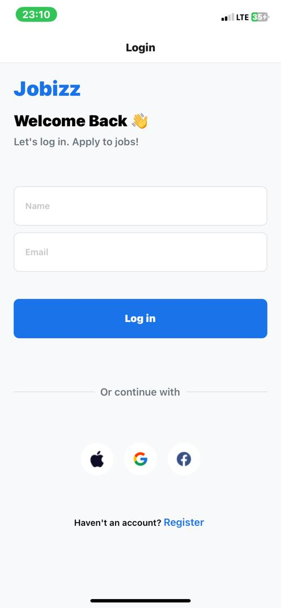
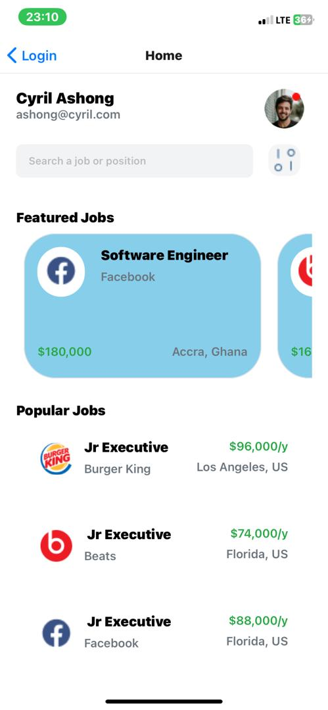

# DCIT202 Mobile Application Development Assignment 4

## Overview
This project involves recreating a mobile application design based on a provided UI mockup. The app consists of a login screen that transitions to a home screen displaying the user's name and email. Additionally, it features sections for popular and featured job cards, styled to match the mockup closely. Custom components are used throughout the application for maintainability and reuse.

## Repository Details
- **Repository Name:** `rn-assignment4-ID` (e.g., `rn-assignment4-1129884`)
- **Local Clone Command:** `git clone <repository-url>`

## Task Breakdown
### 1. Login Screen
- **Functionality:** Captures user's name and email.
- **Navigation:** On pressing login, navigates to the home screen passing the name and email as props.

### 2. Home Screen
- **Functionality:** Displays the name and email received from the login screen.
- **Components:**
  - **Popular Job Cards Section:** Displays 8 job cards.
  - **Featured Job Cards Section:** Displays 8 job cards.

### 3. Job Card Component
- **Type:** Functional Component
- **Props:** Accepts card details such as title, description, and image.
- **Usage:** Used to render each job card in the popular and featured sections.

### 4. Styling
- **Objective:** Match the provided UI design as closely as possible.
- **Tools:** Custom styles and components.

## Screenshot

